Stos LIFO

- Push, Pop

Kolejka FIFO

- Put, Get

## Kolejki Priorytetowe (Djikstra, Kruskal, HeapSort)

- Zawiera operacje: Insert, Max, DeleteMax
- Lista nieuporzadkowana: Insert: O(1), Max: O(n), DeleteMax: O(n)
- Lista uporządkowana: Insert: O(n), Max: O(1), DeleteMax: O(1)
- ### Kopiec (Heap)

  - struktura drzewa binarnego
  - wartości następników są nie większe od poprzednika (max w korzeniu)
  - elementy zapełniają kopiec od lewej do prawej
  - liście są na ostatnim (lub i przedostatnim) poziomie

  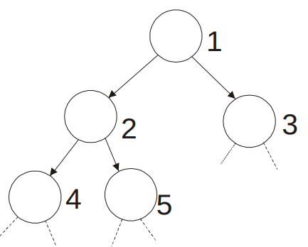
  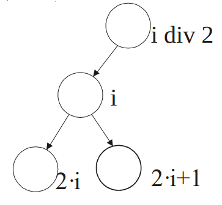

  - [Insert](./heap/ops/Insert.cpp) (używa [UpHeap](./heap/utils/UpHeap.cpp))
  - [Max](./heap/ops/Max.cpp)
  - [DeleteMax](./heap/ops/DeleteMax.cpp) (używa [DownHeap](./heap/utils/DownHeap.cpp))
  - wysokość kopca h = log n
  - implementacja zwykle w tablicy (jako struktura bezwskaźnikowa)

    - zdefiniowana globalnie ilość elementów kopca
    - elementy są zapisywane od A[1], A[0] pełni rolę wartownika

  - budowanie kopca z tablicy A
    - [budowanie kopca od góry (UpHeap)](./heap/ops/BuildUpHeap.cpp): O(n log n)
      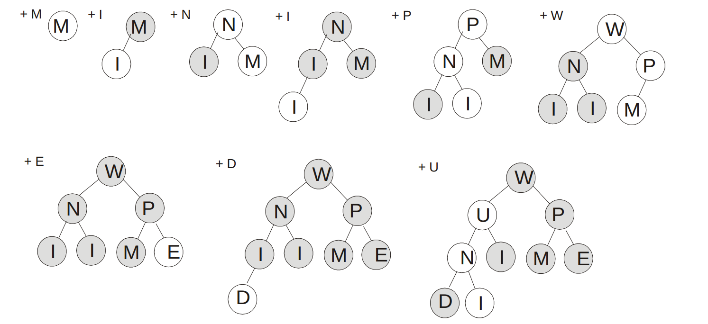
    - [budowanie kopca od dołu (DownHeap)](./heap/ops/BuildDownHeap.cpp): O(n)
      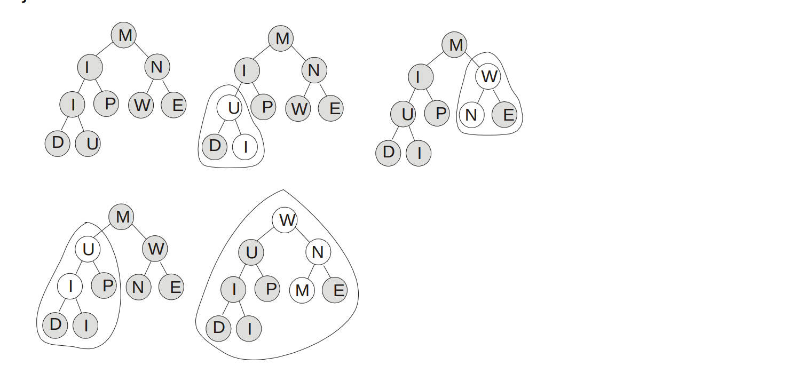

- ### Dwukopiec (Beap)
  - wysokość kopca h = sqrt(n)
  - własności takie jak kopca
  - węzeł może mieć 2 rodziców
    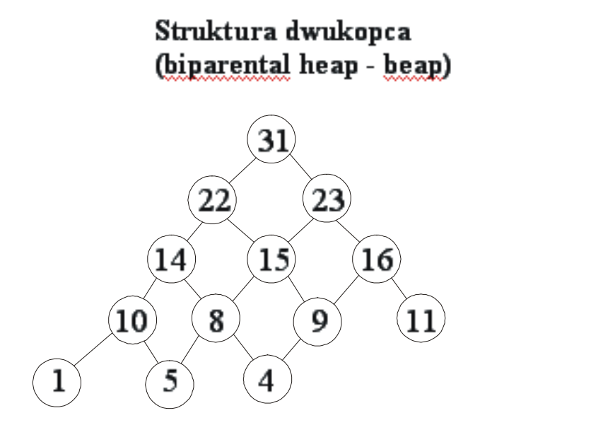
    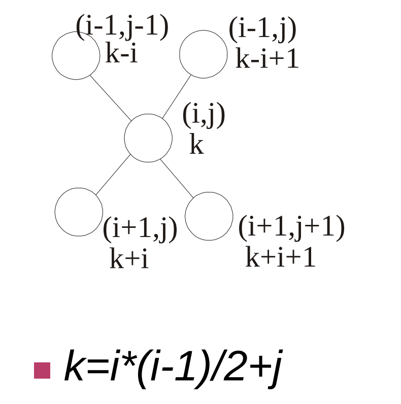
  -  (używa [UpBeap](./beap/utils/UpBeap.cpp))
  - 
  -  (używa [DownBeap](./beap/utils/DownBeap.cpp))
  - ważna jest implementacja [Search](./beap/ops/Search.cpp)
    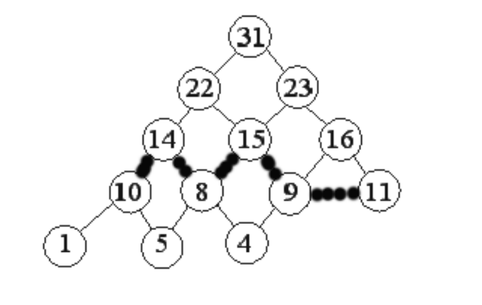

# Kopce złączalne

- abstrakcyjny typ danych rozszerzający definicję kolejki priorytetowej o operacje Union (łączenia dwóch kolejek)
- Operacje:
  - Insert
  - Max
  - DeleteMax
  - Union
  - IncreaseKey

## [Kopiec lewostronny (leftist heap)](./leftistHeap/leftistHeap.cpp)

- ### Operacje
  - [Insert](./leftistHeap/ops/Insert.cpp)
  - [DeleteMax](./leftistHeap/ops/DeleteMax.cpp)
- posiada własności kopca
- każdy węzeł ma atrybut npl (null path length)
- dla każdego węzłą prawe poddrzewo jest nie większe od lewego
  - nplL >= nplR
  - pozwala na wykonywanie operacji na prawym mnieszym podrzewie
- poruszając się w prawo do ostatniego węzła k, wiemy że kopiec ma przynajmniej 2^k elementów
- ### Łączenie kopców lewostronnych [(Union)](./leftistHeap/ops/Union.cpp)
      - złożoność operacji Union to O(log n)
  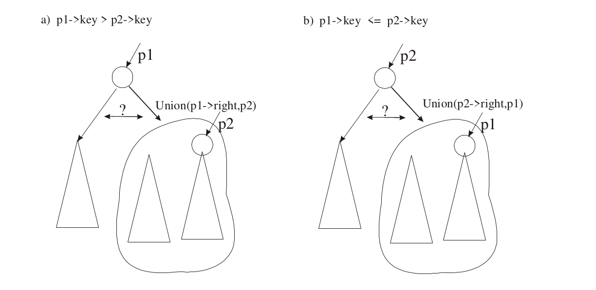
  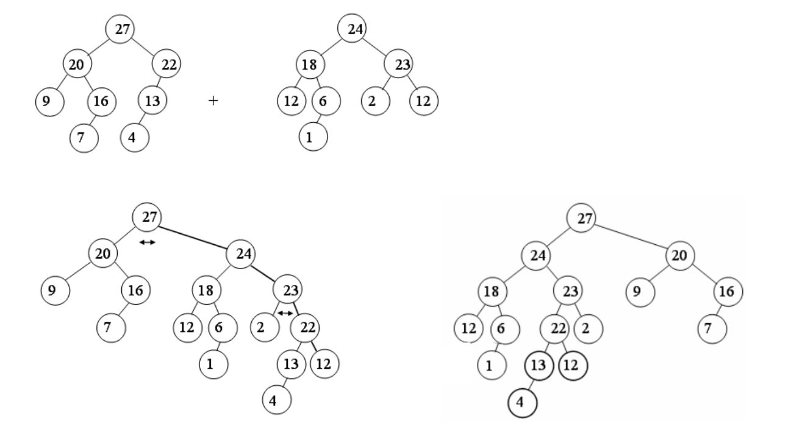

## Kopiec skośny (skew heap)

- podobnie jak kopiec lewostronny, jest strukturą samoorganizującą się
- zamiast atrybutu npl kopiec skośny wykonuje zamiane poddrzew bezwarunkowo
- złożoność operacji Union: - pesymistyczna: O(n) - zamortyzowana O(n log n) / n = O(log n) - usunięcie atrybutu pozwala na uproszczenie struktury danych i kodu, kosztem wydłużenia pojedyńczej operacji Union, z zachowaniem jej złożoności przy wielokrotnym wywolywaniu
  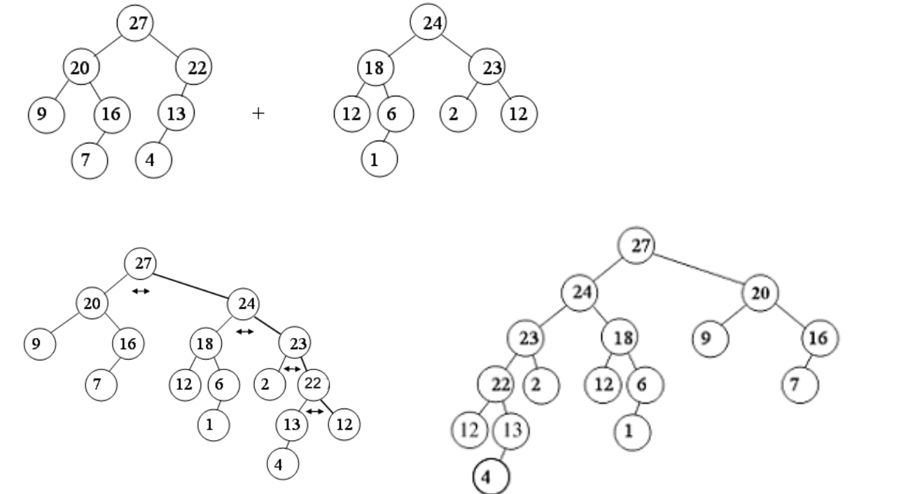

       

- ### Drzewa dwumianowe
  - każde drzewo spełnia warunek kopca (nastepnik nie większy od poprzednika)
  - h = 0: jeden węzeł
  - drzewo o wysokości h jest utworzone przez dwa drzewa o wysokości h-1
  - drzewo o wysokości h zawiera dokładnie 2^h
  - drzewo na poziomie i ma dokładnie iloczyn newtonowski (h i)
  - [Merge Trees](./binominalQueue/utils/MergeTree.cpp) łączenie drzew dwumianowych pod warunkiem łączenia dd. o takiej samej wysokości h, do korzenia pierwszego drzewa dołączane jest drugie, w wyniku powstaje drzewo o wysokości h+1

## Kolejka dwumianowa (binomial queue)

- zbiór (las) drzew dwumianowych
- żadne z drzew dwumianowych w kolejce nie ma takiej samej wysokości
- gdy chcemy otrzymać drzewo o określonej liczbie elementów wystarczy zapisać ją jako binarke np. 10 w binarnym to 1010 - czyli 8 el + 2 el - to drzewa o wysokości kolejno 3 i 1, wynika to z faktu że każde drzewo zawiera 2^k elementów
- ### Operacje
  - [Union](./binominalQueue/ops/Union.cpp): O(log n)
  - Max: O(log n) - wymaga przeszukakania korzeni drzew na liście
  - [Insert](./binominalQueue/ops/Insert.cpp) (używa Union): O(log n)
  - [DeleteMax](./binominalQueue/ops/DeleteMax.cpp) (używa Union): O(log n)
    - usunięcie elementu maksymalnego
    - powstała kolejka jest łączona z pierwotna
- łączenie kolejek dwumianowych sytuacje (składniki, wynikowe):
  - nie ma drzewa o wysokości k -> nie ma k
  - 1 drzew o k -> 1 drzewo k
  - 2 drzewa k -> 1 drzewo k+1
  - 1 drzewo k + 2 drzewa k-1 -> 1 drzewo k+1
  - 2 drzewa k + 2 drzewa k-1 -> 1 drzewo k+1 + 1 drzewo k
    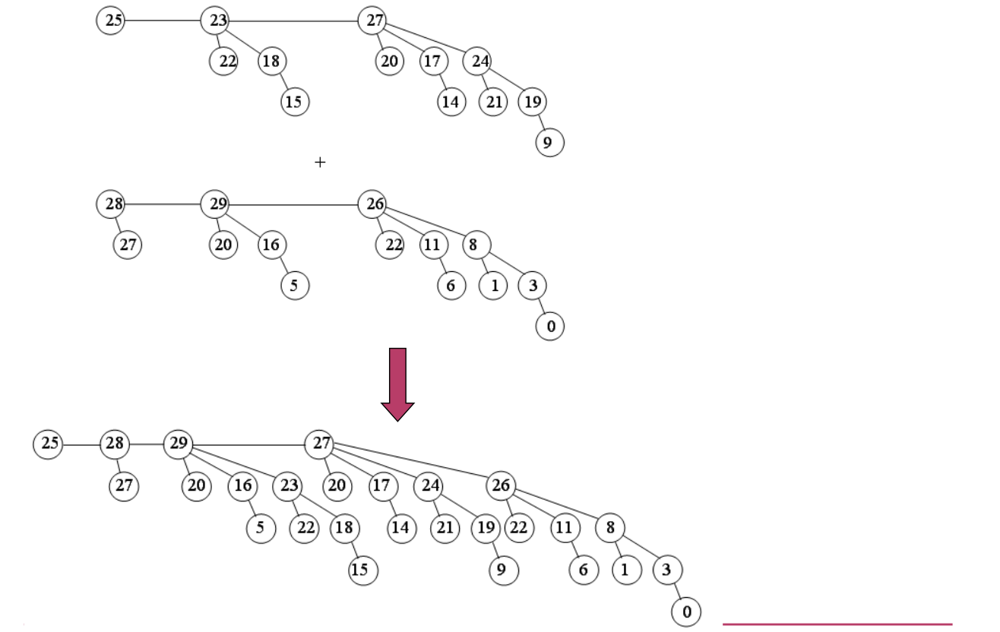
- 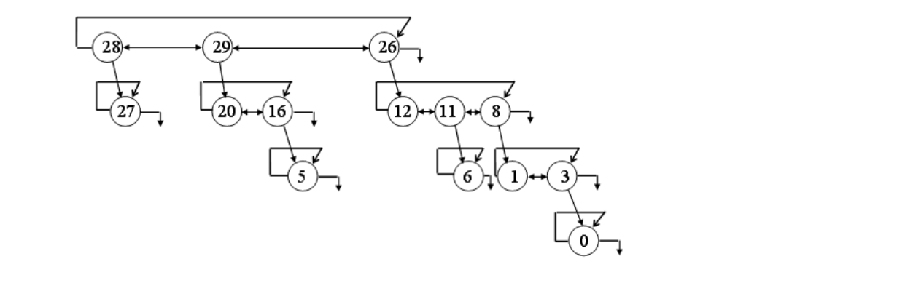

      

## [Kopiec (Kolejka) Fibonacciego](./fibonacciHeap/fibonacciHeap.cpp)

- najlepsza struktura do implementacji kolejki priorytetowej
- lazy programing
- składa sie z lasu nieuporządkowanych drzew dwumianowych, zachowujących war. kopca
  - każdy węzeł w takim drzewie może stracić najwyżej jednego syna (wraz z poddrzewem)
  - węzeł jest wtedy markowany
- nieuporządkowane, mogą wystąpić wielokrotności, dowolność
- istnieje wskaźnik na maksymalny element ze wszystkich drzew w liście
- liczba elementów w drzewie o wysokości h jest >= 1.618^h
  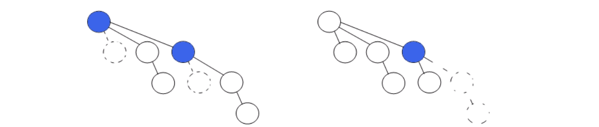
- ### Operacje
  - IncreaseKey: zamortyzowany O(1)
  - Union: O(1)
    - po prostu łączy dwie listy
    - wybiera spośród max(maxP1, maxP2) i ustawia jako nowy max
  - Insert: O(1)
  - DeleteMax: O(log n)
    - wcześniej się nie chciało to teraz trzeba zapierdalać
    - usuwanie korzenia max
    - synowie tego korzenia dołaczani są do listy
    - #### Konsolidacja [(Consolidate)](./fibonacciHeap/utils/Consolidate.cpp)
      - odbywa się konsolidacja drzew, tak aby każde drzewo miało różne stopnie
      - dodatkowa tablica do indeksowania wysokości drzew (stopni korzeni)
      - przeglądamy tablicę korzeni i łączymy drzewa o tej samej wysokości
      - uaktualniamy wskaźnik na el. maksymalny
      - [AddToLast](./fibonacciHeap/utils/AddToLast.cpp)
      - [Consolidate](./fibonacciHeap/utils/Consolidate.cpp)
      - [Extract](./fibonacciHeap/utils/Extract.cpp)
      - [MergeTree](./fibonacciHeap/utils/MergeTree.cpp)
  - IncreaseKey O(log n), koszt zamortyzowany O(1)
    - zwiekszanie wartości w kluczu p->key
    - jeżeli naruszony jest warunek kopca to odcinamy węzeł z całym poddrzewem i dołączamy go do listy
    - jeżeli to już drugi oddcinany syn to odcinamy również ojca
    - może spowodować dalsze rekuręcyjne odcięcia

# Słowniki

- mają unikalny klucz
- istnieje relacja więszkości pomiędzy kluczami
- Operacje:
  - Search
  - Insert
  - Delete

## Drzewa BST (Binary Search Tree)

- dla każdego węzła wartości klucza prawego poddrzewa są większe, po lewo mniejsze, od klucza węzła
- Operacje:
  - [Search](./bst/ops/Search.cpp): avg O(log n), pes O(n)
  - [Insert](./bst/ops/Insert.cpp): avg O(log n), pes O(n)
  - [Delete](./bst/ops/Delete.cpp)
    - przypadki:
      - element jest w liściu: usuwanie liścia
      - element ma jeden następnik: usuwanie węzła, podłączenie poddrzewa węzła do rodzica
      - element ma dwa następniki: zastąpnienie węzła poprzez inny
        - najmniejszy z prawego poddrzewa
        - największy z lewego poddrzewa
      - przy kolejnych usuwaniach, wybór elementu może odbywać się losowo z lewego lub prawego poddrzewa (najwiekszy, najmniejszy)
- Wysokość BST

  - średnia 1.39 log(n)
  - BST jest średnio 39% więszy od drzewa idealnie zrównoważonego
  - pesymistyczna to n

- Zrównoważone drzewa binarne
  - gdzie pesymistyczna złożoność wyszukiwania jest pes O(log n)

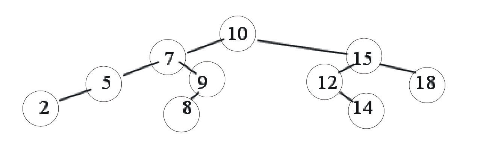

## [Drzewa AVL](./avl/avl.cpp)

- Samorównoważące się drzewo BST
- dla każdego węzła wysokośc poddrzew nie różni się wiecej niż jeden
- każdy węzeł posiada atr. bl = hL - hR
- Wysokość AVL
  - pesymistyczna 1.44 log n
- [Rotacje](./avl/utils/rotations.cpp):
  - podstawowe: RR, LL
  - używające podstawowych: RL, LR

## B-Drzewa

- Do przechowywania indeksów dużych danych w pamięci zewnętrznej
- Uporządkowane strony odpowiadające blokom pamięci zewnętrznej
- wszystkie strony (z wyjątkiem korzenia) są zapełnione przynajmniej w połowie
- B-Drzewo jest rzędu m
  - każda strona ma maksymalnie 2\*m kluczy
  - każda strona z wyjątkiem korzenia posiada przynajmniej m kluczy
  - każda strona niebędąca liściem ma k+1 następników, k - liczba kluczy
  - wszystkie liście na tym samym poziomie
- [Search](./btree/ops/Search.cpp)
- Wysokość B-Drzewa: log_2m (n) <= h <= log_m (n)
  - tzn. dla drzewa rzędu 512, n < 10^9, wtedy wysokosc h <= 3
  - czyli w praktycznych rozwiązaniach złożoność operacji słownikowych jest stała O(1)

B-Drzewo rzędu m = 2
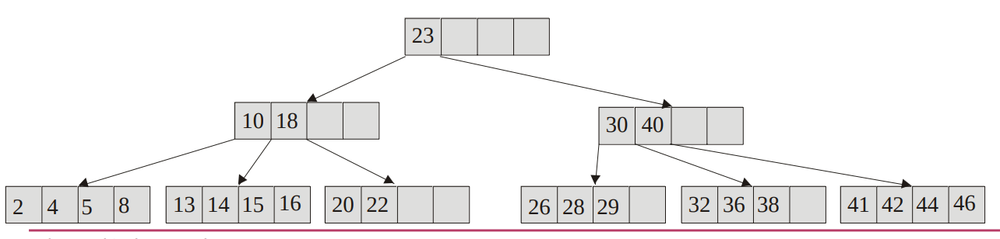

- Usuwanie: 2 - łączenie stron

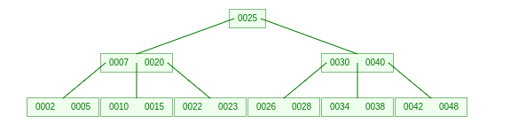
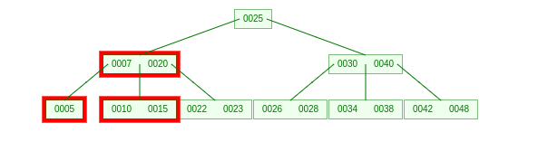
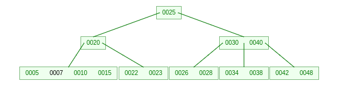
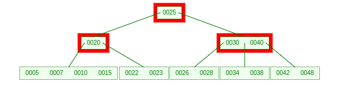
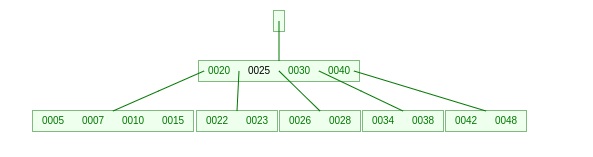
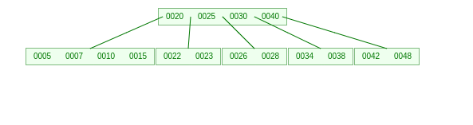

- Usuwanie: 34 - równoważenie stron

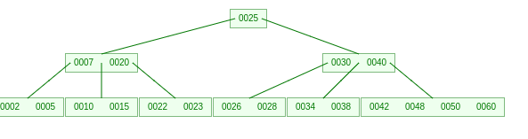
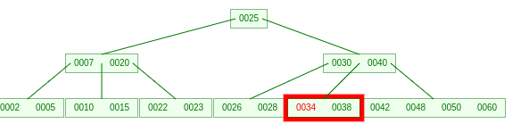
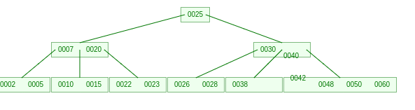
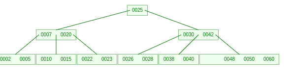
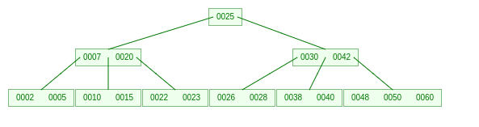

### B\*-Drzewa - Modyfikacja B-Drzew

- Normalnie B-Drzewa średnio zapełnione są w 69%, dużo miejsca się marnuje
- modyfikacja przyjmuje B\*-Drzewo, gdzie każda strona jest wypełniona w 2/3 zamiast w 1/2
- wtedy średni stopień zapełnienia stron wynosi 81%
- Dalsze modyfikacje B^n-Drzewa
  - gdzie wskaźnik minimalnego zapełnienia wynosi (n + 1) / (n + 2)

## 2-3 Drzewa (Binarne B-Drzewa, B-Drzewa rzędu m = 1)

- wskaźniki pionowe, poziome
- strona w B-Drzewach, odpowiada wskaźnikowi poziomemu
- wysokość: h <= 2\*log (n)
  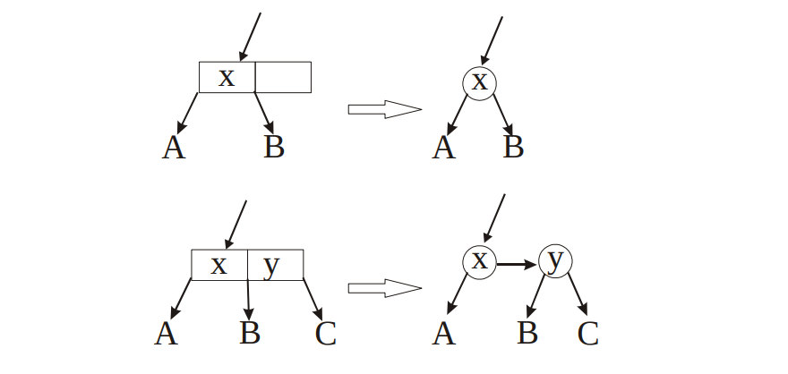

- wstawianie - jak do B-Drzew rzedu m = 1

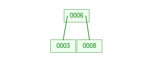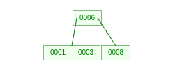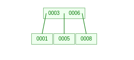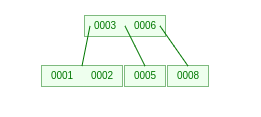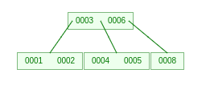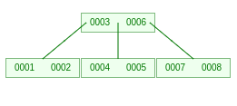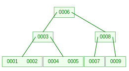

- usuwanie: 3

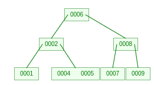

- usuwanie : 1

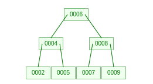

- usuwanie: 6

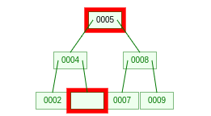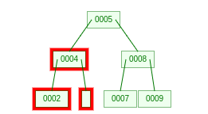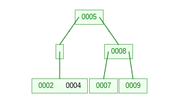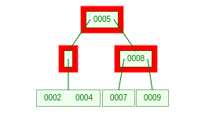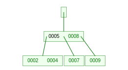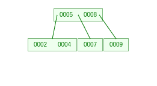

## 2-3-4 Drzewa Poziomo-Pionowe (Symetryczne Binarne B-Drzewa, SBB)

- hipotetyczne B-Drzewa o maks. 3 elementach na stronie
- równoważne CC
- nie są dokładnie B-Drzewami, więc ich własności się różnią:
  - każdy węzeł zawiera: klucz i co najwyżej 2 wskaźniki
  - każdy wskaźnik jest poziomy lub pionowy
  - ścierzka od korzenia do każdego węzła pustego zawiera tyle samo wskaźników pionowych
  - żadna ścierzka od korzenia nie może zawierać dwóch kolejnych wskaźników poziomych
- Wysokość: log(n+1) <= h <= 2\*log(n+2) -2
  - średnia 1.002\*log (n)
- Wyszukiwanie:
  - może być zastosowana identyczna procedura jak w przypadku drzew BST
- Wstawianie
  - bez rotacji bo za dużo trzeba by definiować
  - zawsze gdy spotkamy 4 węzeł, ulega on podziałowi
  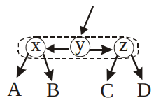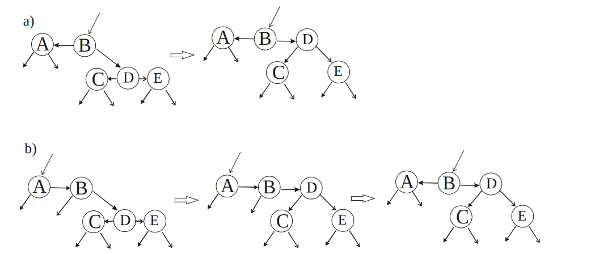
  - eliminuje sztuczną asymetrię, która występuje w 2-3 drzewach
    - tzn. wszystkie pełne węzły (4-węzły) dzieli się od razu

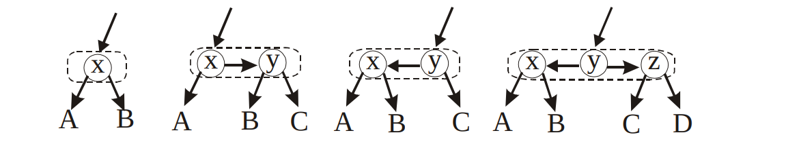

### Drzewa Czerwono-Czarne (2-3-4 Drzewa, z kolorowaniem węzłów zamiast wsk. pion/poz)

- Każdy węzeł jest czerwony lub czarny
- Korzeń drzewa jest zawsze czarny
- Jeśli węzeł jest czerwony to oba następniki są czarne
- Każda ścierzka od korzenia do węzłą pustego zawiera tyle samo węzłów czarnych
- Przewagą CC jest uproszczenie struktury węzła
- Wstawianie: - przy napotkaniu 4-węzła - następuje zamiana koloru z czerwonego na czarny (z poziomych wskaźników, na pionowe)
  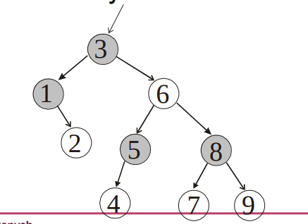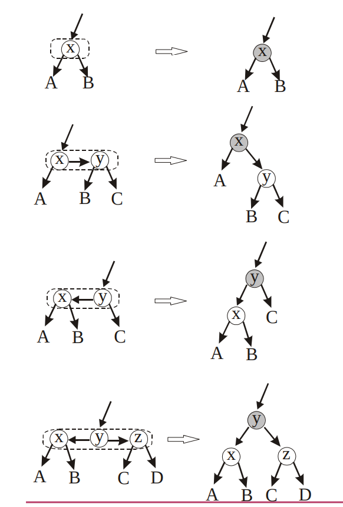

- Dowolne drzewo AVL może zostać przekształcone w 2-3-4 drzewo
  - oznaczając wskaźniki wysokością poddrzew
  - dla parzystych - węzeł będzie zawierał poziome wskaźniki (węzeł czarny)
  - dla nieparzystych - węzeł będzie zawierał pionowe wskaźniki (węzeł czerwony)
    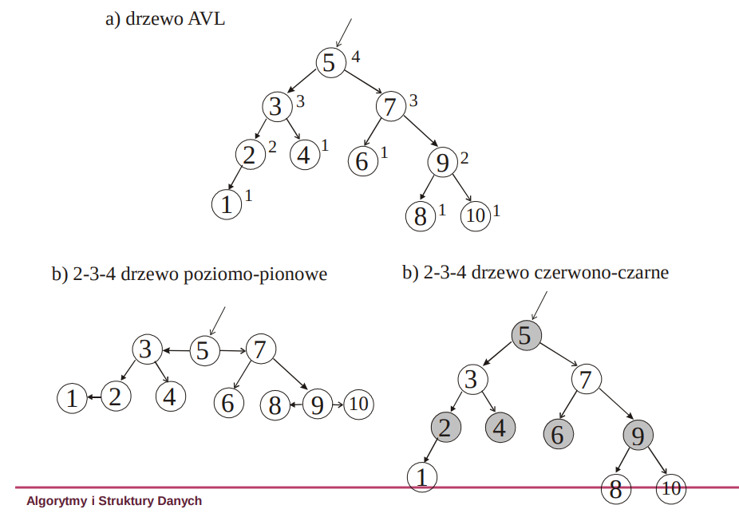

## Struktury samoorganizujące się

- ## Drzewa Splay (Samoorganizujące się drzewa BST)

  - każdorazowe przestawianie elementu do korzenia, gdy ten jest wyszukiwany
  - Dana jest funkcja Splay

    - jeśli w drzewie znajduje się element v, zostanie on przeniesiony do korzenia
    - jeżeli nie, ostatnio napotkany v' węzeł zostanie przeniesiony do korzenia
    - nie istnieje żaden inny wezeł pomiędzy wartościami v a v'

  - Operacje:
    - [Search](./splay/ops/Search.cpp) - wywołuje splay i tyle basically
    - [Insert](./splay/ops/Insert.cpp)
      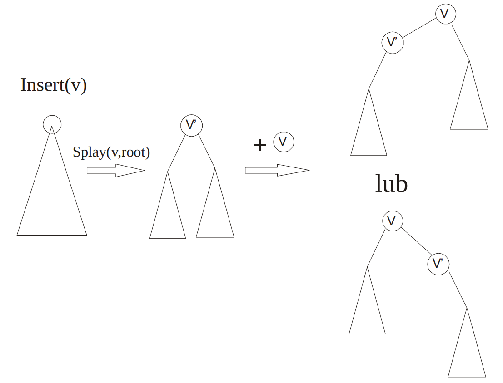
    - [Delete](./splay/ops/Delete.cpp)
      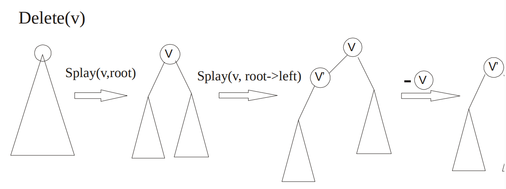
  - Splay: pes. k operacji splay: O(k\*log n)
    - Splay z MoveToRoot jest mega słaby bo może zrobić się lista
    - Dla prawidłowej implementacji należy zdefiniować 6 operacji rotacji: - prawe i lewe - Zig - ZigZig - ZigZag
      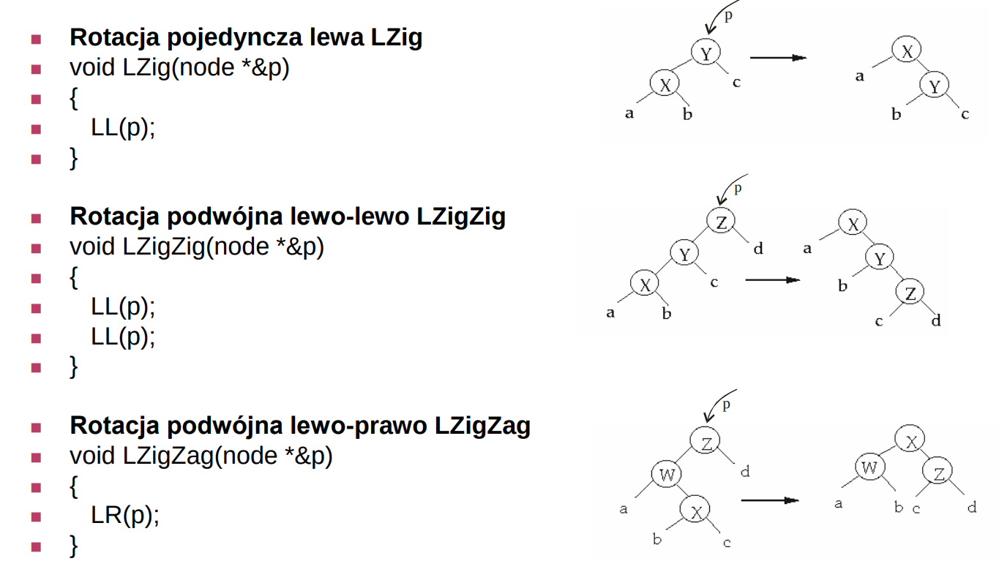

## Zady i walety drzew binarnych

- BST
  - Zalety
    - najprostsze implementacje
  - Wady
    - h: 39% większa od idealnie zrównoważonego
    - jest liniowa wysokość w przypadku pesymistycznym
- 2-3

  - Zalety
    - prostsza implementacja
  - Wady
    - jedyna wada to brak zalet

- 2-3-4

  - Zalety
    - gdzie elementy są czesto dodawane i usuwane
  - Wady

- AVL

  - Zalety
    - lepsze gdzie są małe zmiany w drzewach
    - gdzie głównie wykonywana jest operacja wyszukiwania

- Splay

  - Zalety
    - szybkie, gdy często odwołujemy się do tych samych kluczy
  - Wady

    - liniowa złożonośc pesymistyczna
    - zamortyzowana złożoność jest logarytmiczna

    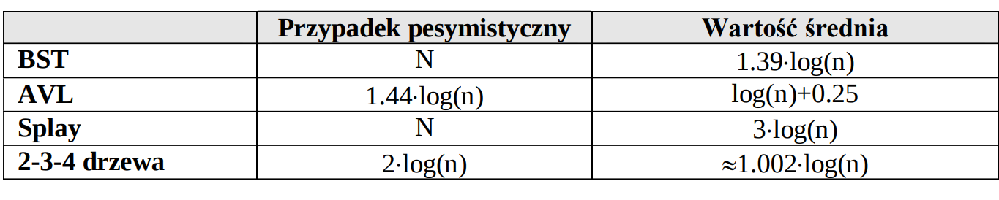

## RST

- drzewa wyszukiwań pozycyjnych
- Wyszukiwanie: O(log n)

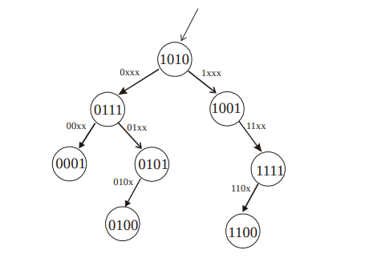

## TRIE

- drzewa prefiksowe
- Wyszukiwanie: O(log n)

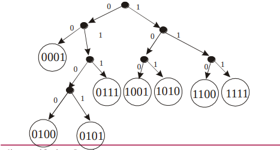

# Sortowanie

- stabilność algorytmu sortowania polega na zachowaniu kolejności elementów o tym samym kluczu.
- algorytm sortuje w miejscu - gdy złożoność pamięciowa algorytmu jest stała O(1)

## [Selection Sort](../sortowanie/SelectionSort.cpp) O(n^2)

- liczba przestawień jest linowa O(n), żaden inny algorytm sortowania nie jest w stanie osiągnąć lepszej
- liczba porównań jest kwadratowa O(n^2)
- liczba porównań nie zależy od początkowego uporządkowania danych
- Seleciton Sort nie jest stabilny dla tablic
- Selectoin Sort dla listy jest stabilny
  - tworzymy wtedy nowa listę do której wstawiamy kolejno elementy minimalne
- nigdy nie sięga do tylu, sięga tylko do przodu
  - elementy za bierzącą pozycją są już posortowane, i nie przesuwane
- szybkość działania algorytmu NIE zależy od początkowego uporządkowania danych

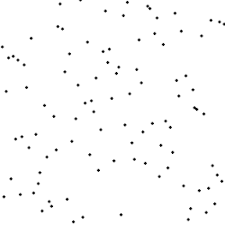

## [Insertion Sort](../sortowanie/InsertionSort.cpp) O(n^2)

- w przeciwieństwie do SelectionSort algorytm sięga do tyłu
- elementy przed bierzącą pozycją są posortowane, bedą jednak przesuwane i nie są na ostatecznych pozycjach
- szybkość działania algorytmu zależy od początkowego uporządkowania danych
- dla posortowanego ciągu algorytm wykonuje n porównań i żadnych przestawień
- algorytm jest stabilny

## [Bubble Sort](../sortowanie/BubbleSort.cpp) O(n^2)

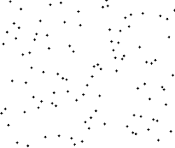

### [Mix Sort (Coctail Sort)](../sortowanie/MixSort.cpp) O(n^2)

- bąbelkowe z dwóch stron

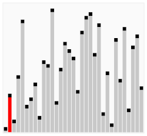

## [Comb Sort](../sortowanie/CombSort.cpp) pes: O(n^2) best: O(n log n)

- porównujemy elementy oddalone od siebie o 10/13 rozmiaru tablicy

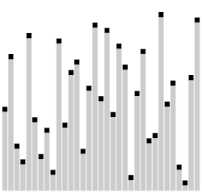

## [Heap Sort](../sortowanie/HeapSort.cpp) O(n log n)

- niestabilny
- jest niewrażliwy na początkowe posrotowanie danych
- preferowany dla ciągów słabo posortowanych
- O(n log n)
  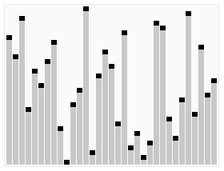

## [Quick Sort](../sortowanie/QuickSort.cpp) pes: O(n^2) avg: O(1.39 n log n)

- pamieciowa O(n), lub O(log n) (z lepszym wyborem)
  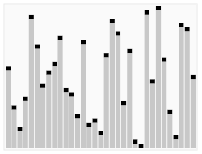

### Intro Sort

- połaczenie QuickSort i HeapSort
- O(n log n)
